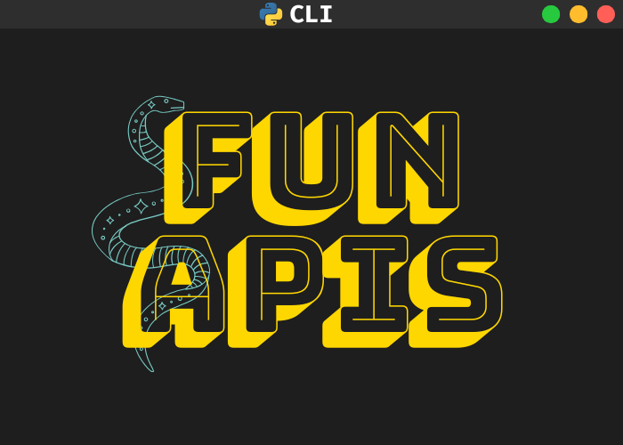

<p align="center">
    
    <a href="https://badge.fury.io/py/Fun-APIs-CLI"></a>
</p>

# Fun APIs CLI

A simple Python command-line interface utility to interact with various fun APIs: facts, animals, quotes...
This project, designed for learning and fun, can pull random facts, animal data, quotes and much more via API Ninjas and other API sources.

## Installation
There are two methods to achive this:
1. Through PyPi:
Head to the PyPi [project page](https://pypi.org/project/Fun-APIs-CLI/) and install the package, following the instructions.
2. Locally:
Clone the repository:
```bash
git clone https://github.com/tahadnan/Fun-APIs-CLI.git
cd Fun-APIs-CLI
cd Fun-APIs-CLI
```
**(Highly Recommended)Set up a virtual environment and install dependencies:**
```bash
python -m venv venv
source venv/bin/activate  # For Mac/Linux
.\venv\Scripts\activate   # For Windows
pip install -r requirements.txt
```
Run the program:
```bash
python -m fun_apis.cli -h 
```
## To-Do
+ Add shell completetion support for bash, zsh and pwsh.

## Contributing

This project relies on collaboration and community support! It's designed to be an evolving, living tool, and while it currently supports APIs for fun facts, animals, and quotes, the possibilities are endless. Whether you'd like to add new APIs, enhance existing features, refine the code, or even update the documentation, contributions are welcome. Let's make this CLI a better and more diverse tool together. You can fork the repository, look at the code, and send your pull requests-we are excited to see what you will add to the project!
 

